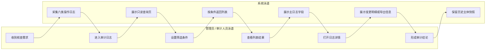
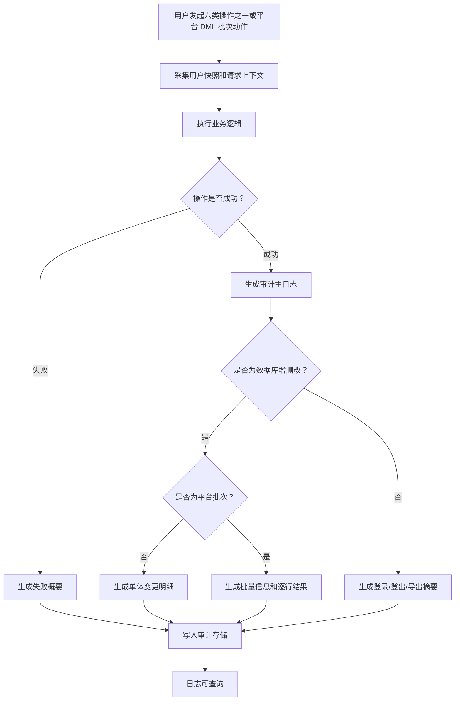
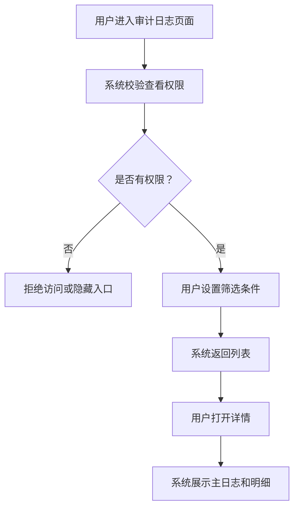

# IoT Admin 审计日志 PRD

Source: 2026-05-19 用户需求输入，`/Users/user/Downloads/IOT 审计日志技术方案.pdf`，[[AIoT-Platform/iot-admin-audit-log/context]]，[[AIoT-Platform/iot-admin-audit-log/decision-log]]

版本：V1.2  
状态：批次口径收敛评审稿  
最后更新：2026-06-10

## 1. 产品概述

IoT Admin 平台需要新增审计日志查看能力，用于满足合规要求，追踪平台内关键用户操作。首版审计日志只针对六项行为采集和存储日志：数据库新增、数据库删除、数据库修改、用户登录、用户登出、导出数据。其中平台批量导入新增、平台批量删除、平台批量导入更新不新增独立审计动作，而是分别作为 `INSERT`、`DELETE`、`UPDATE` 的批次记录展示。

审计日志需要回答“谁在什么时候、从哪里、对什么对象、做了什么、结果如何、数据如何变化”。真实用户的 uid 和用户姓名必须作为日志产生时的快照保存，不跟随用户账号资料的后续更新或删除而变化。

## 2. 背景与问题定义

当前 IoT Admin 的关键操作事实可能分散在业务表、接口日志、链路日志或应用日志中，难以稳定支撑合规核查。开发技术方案初稿已经提出使用 `t_audit_log` 主表和 `t_audit_log_detail` 明细表记录审计日志，但产品侧需要收敛清楚首版“采什么、查什么、展示什么”。

首版不追求覆盖所有后台行为，避免日志量和实现边界失控。本 PRD 将范围收敛到六项明确行为：

| 序号 | 行为 | 审计类型 |
| --- | --- | --- |
| 1 | 数据库新增 | `INSERT`，含平台批量导入新增 |
| 2 | 数据库删除 | `DELETE`，含平台批量删除 |
| 3 | 数据库修改 | `UPDATE`，含平台批量导入更新 |
| 4 | 用户登录 | `LOGIN` |
| 5 | 用户登出 | `LOGOUT` |
| 6 | 导出数据 | `EXPORT` |

## 3. 目标与成功指标

| 目标 | 成功指标 |
| --- | --- |
| 满足合规查看要求 | 授权用户可在 IoT Admin 查看六类审计日志 |
| 支撑操作追溯 | 列表和详情能定位业务流水号、用户、操作方式、模块、业务主键、结果、IP、`traceId` |
| 支撑数据变更回溯 | 数据库新增 / 修改 / 删除详情能展示单体变更前后数据，批次记录能展示批量范围、数量、目标值和逐行结果 |
| 支撑数据流出核查 | 导出日志能展示导出条件、导出规模、文件信息和操作主体 |
| 控制功能边界 | 普通查询 / 筛选 / 翻页不记录审计日志；审计日志不支持导出 |

## 4. 用户角色与适用范围

| 角色 | 说明 | 核心诉求 |
| --- | --- | --- |
| 合规 / 安全管理员 | 负责审计检查、风险追踪和合规举证 | 按时间、用户、模块、对象、操作类型查询审计日志 |
| IoT 平台管理员 | 负责平台配置、产品、用户、白名单、App 等后台操作 | 在问题发生后确认是谁修改、删除、新增或导出了数据 |
| 研发 / 运维人员 | 负责线上问题定位和数据修复评估 | 通过 `traceId`、业务流水号、业务主键和变更明细定位问题 |

适用范围：

| 范围 | 说明 |
| --- | --- |
| 使用端 | IoT Admin Web 后台 |
| 采集行为 | `INSERT`、`DELETE`、`UPDATE`、`LOGIN`、`LOGOUT`、`EXPORT` |
| 数据隔离 | 当前按非多租户场景处理；不要求 `company_code` |
| 不适用 | 独立 `IMPORT` / `BATCH_*` 审计动作、外部系统同步、审计详情查看记录、附件下载记录、登录失败、会话过期、风险告警、自动报表 |

## 5. 用户故事 / JTBD

1. 作为合规管理员，当需要核查某个用户在某段时间内的关键操作时，我想按用户、操作类型和业务主键查询审计日志，以便快速定位操作事实。
2. 作为平台管理员，当产品配置被误改时，我想查看数据库修改日志中的变更前后数据，以便判断影响范围。
3. 作为平台管理员，当数据被删除时，我想查看删除前的关键字段快照，以便确认被删除对象。
4. 作为合规管理员，当用户导出数据时，我想查看导出条件、导出规模和文件信息，以便核查数据流出行为。
5. 作为研发 / 运维人员，当线上问题需要定位链路时，我想通过 `traceId` 和 `serial_code` 查询审计日志，以便关联请求和变更明细。
6. 作为合规管理员，当平台发生批量导入新增、批量删除或批量导入更新时，我想在列表中看到一条批次记录，并在详情中查看批量对象范围、影响数量、统一目标值或导入逐行结果，以便判断批量操作影响。

## 6. 使用场景

| 场景 | 触发条件 | 系统响应 | 预期结果 |
| --- | --- | --- | --- |
| 数据库新增 | 用户在后台创建业务对象，或通过平台批量导入新增对象 | 记录主日志、新增后关键字段；批量导入新增按批次一条记录 | 可追溯新增人、对象、新增数据和批量导入结果 |
| 数据库修改 | 用户修改业务对象，或通过平台批量导入更新对象 | 记录主日志和变更前后数据；批量导入更新按批次一条记录 | 可查看字段差异和批量更新影响 |
| 数据库删除 | 用户删除业务对象，或通过平台批量删除对象 | 记录主日志和删除前关键字段；批量删除按批次一条记录 | 可确认删除对象、删除人和批量删除范围 |
| 用户登录 | 用户成功登录后台 | 记录登录时间、uid、姓名快照、IP、User-Agent | 可追踪账号访问行为 |
| 用户登出 | 用户主动登出后台 | 记录登出时间、uid、姓名快照、IP、User-Agent | 可追踪会话结束行为 |
| 导出数据 | 用户导出业务数据 | 记录导出条件、规模、文件信息和结果 | 可核查数据流出 |

## 7. 用户旅程图

## 8. 方案对比

| 方案 | 描述 | 结论 |
| --- | --- | --- |
| 全量记录所有用户操作 | 查询、筛选、翻页、查看等全部记录 | 不采用，日志量和审计价值不匹配 |
| 为导入、批量新增独立审计动作 | 新增 `IMPORT`、`BATCH_INSERT`、`BATCH_DELETE`、`BATCH_UPDATE` 等动作 | 不采用，会破坏六项行为收敛并增加查询口径 |
| 将平台批量动作映射为 DML 批次记录 | 平台批量导入新增映射 `INSERT`，批量删除映射 `DELETE`，批量导入更新映射 `UPDATE` | 采用，既保留六项行为收敛，也能追溯平台批量影响 |
| 只记录六项行为 | 新增、删除、修改、登录、登出、导出 | 采用，范围明确，可和技术方案快速对齐 |

## 9. 需求范围

### 9.1 纳入范围

- 新增 IoT Admin 审计日志查看页面。
- 审计日志列表查询、筛选、排序和分页。
- 审计日志详情查看。
- 六类审计行为采集和存储：
  - 数据库新增：`INSERT`
  - 数据库删除：`DELETE`
  - 数据库修改：`UPDATE`
  - 用户登录：`LOGIN`
  - 用户登出：`LOGOUT`
  - 导出数据：`EXPORT`
- 真实用户 uid、用户姓名、账号标识按日志产生时快照存储。
- 数据库新增 / 修改 / 删除记录变更前后数据或删除前快照。
- 平台批量导入新增纳入 `INSERT`，平台批量删除纳入 `DELETE`，平台批量导入更新纳入 `UPDATE`；列表按批次展示一条审计记录，详情展示批量信息。
- 导出数据记录导出条件、导出规模、文件信息和操作结果。
- 用户邮箱、用户名字、用户 IP 脱敏展示；密码、Token、密钥、验证码不得明文落库。

### 9.2 不纳入范围

- 不新增独立 `IMPORT` 审计动作；平台批量导入新增 / 更新分别按 `INSERT` / `UPDATE` 批次记录。
- 不新增独立 `BATCH_*` 审计动作；平台批量删除按 `DELETE` 批次记录。
- 不要求为批量操作中的每一个对象在列表生成独立主日志；逐对象结果在批次详情中查看。
- 不采集外部系统同步日志。
- 不采集审计日志详情查看行为。
- 不采集附件下载行为。
- 不采集登录失败和会话过期。
- 不提供审计日志导出能力。
- 不提供审计日志编辑、删除、手动补录或一键回滚能力。
- 不建设独立运维日志平台，不替代应用日志、链路日志或错误码体系。

### 9.3 已确认口径

| 事项 | 口径 |
| --- | --- |
| 采集行为 | 仅六项：`INSERT`、`DELETE`、`UPDATE`、`LOGIN`、`LOGOUT`、`EXPORT` |
| 平台批量动作 | 批次一条；批量导入新增 -> `INSERT`，批量删除 -> `DELETE`，批量导入更新 -> `UPDATE` |
| 普通查询 / 筛选 / 翻页 | 不记录审计日志 |
| 审计日志导出 | 不支持 |
| 多租户字段 | 非多租户场景，不要求 `company_code` |
| 技术文档关系 | 技术文档必须满足本 PRD 的需求定义，不能用初稿字段反向收窄需求 |

## 10. 核心流程

### 10.1 审计采集流程

### 10.2 审计查看流程

## 11. 功能需求详述

### 11.1 审计日志列表

筛选项必须和列表字段匹配。除操作列外，列表中的业务字段均应在筛选区有对应筛选项。

| 列表字段 | 筛选项 | 说明 |
| --- | --- | --- |
| 操作时间 | 开始时间、结束时间 | 支持时间范围查询 |
| 业务流水号 | 业务流水号 | 对应技术字段 `serial_code` |
| 主体 | 主体 | `user` 等主体标识 |
| uid / 姓名快照 | uid / 姓名快照 | 按 uid 或姓名快照搜索 |
| 分类 | 分类 | `AUTH`、`DML`、`EXPORT` |
| 操作类型 | 操作类型 | `INSERT`、`DELETE`、`UPDATE`、`LOGIN`、`LOGOUT`、`EXPORT` |
| 操作方式 | 操作方式 | 单体操作、批量操作 |
| 模块 | 模块 | 业务模块 |
| 业务主键 | 业务主键 | 对应技术字段 `resource_id`，支持按业务主键查询 |
| 结果 | 结果 | 成功 / 失败 |
| IP | IP | 脱敏展示和查询 |
| `traceId` | `traceId` | 链路 ID |
| 操作 | 无 | 仅为“查看”按钮，不作为筛选项 |

页面规则：

- 列表只读，不提供新增、编辑、删除和导出入口。
- 默认按操作时间倒序。
- 列表查询、筛选、翻页不记录审计日志。
- 空状态提示用户调整筛选条件。

### 11.2 审计日志详情

| 信息分组 | 字段 |
| --- | --- |
| 基本信息 | `serial_code`、`traceId`、分类、操作类型、操作时间、结果、错误码、错误信息、耗时、摘要 |
| 操作主体 | 主体类型、主体、用户 uid、用户姓名快照、账号标识、认证渠道 |
| 请求上下文 | HTTP 方法、请求 URI、客户端 IP、User-Agent、请求摘要、返回摘要 |
| 操作对象 | 模块、资源类型、业务主键、业务对象名称 |
| 变更明细 | 表 / 资源、操作类型、主键或业务键、变更前、变更后、影响行数 |
| 批量信息 | 操作方式、批次 ID、对象范围、总行数、成功行数、失败行数、统一目标值、导入文件名、逐行结果 |
| 导出信息 | 导出条件、导出行数、字段范围、文件名、文件大小、生成时间 |

规则：

- 数据库新增：变更前为空，变更后展示新增后的关键字段。
- 数据库修改：展示变更前和变更后，至少包含发生变化的字段。
- 数据库删除：展示删除前关键字段，变更后为空或标记为已删除。
- 平台批量导入新增：`audit_action=INSERT`，列表展示一条批次记录；详情展示导入文件、对象范围、新增成功 / 失败数量和逐行结果。
- 平台批量删除：`audit_action=DELETE`，列表展示一条批次记录；详情展示删除对象范围、影响数量、统一目标值和逐行结果。
- 平台批量导入更新：`audit_action=UPDATE`，列表展示一条批次记录；详情展示导入文件、更新对象范围、更新字段 / 目标值、成功 / 失败数量和逐行结果。
- 登录 / 登出：不需要变更明细，仅展示主体和请求上下文。
- 导出数据：展示导出条件、规模和文件信息，不提供审计日志导出。

### 11.3 平台批量动作与 DML 关系

| 平台动作 | 审计分类 | 操作类型 | 操作方式 | 列表记录 | 详情要求 |
| --- | --- | --- | --- | --- | --- |
| 平台批量导入新增 | `DML` | `INSERT` | `BATCH` | 批次一条 | 导入文件、对象范围、总行数、成功 / 失败行数、新增后关键字段或逐行结果 |
| 平台批量删除 | `DML` | `DELETE` | `BATCH` | 批次一条 | 删除对象范围、影响数量、统一目标值、删除前关键字段摘要或逐行结果 |
| 平台批量导入更新 | `DML` | `UPDATE` | `BATCH` | 批次一条 | 导入文件、对象范围、更新字段、统一目标值或逐行值、成功 / 失败行数、逐行结果 |

规则：

- 不新增 `IMPORT`、`BATCH_INSERT`、`BATCH_DELETE`、`BATCH_UPDATE` 等审计动作枚举。
- 批次主日志使用一个 `serial_code`；批次内逐行结果在详情中展示，并可通过 `batch_id` 或明细记录关联。
- 如果批量更新存在统一目标值，必须记录统一目标值；如果按导入文件逐行更新不同值，需要记录导入字段映射和逐行结果。
- 列表筛选支持按“操作方式”区分单体操作和批量操作；批量的新增 / 删除 / 修改含义由“操作类型”表达。

### 11.4 操作主体快照

| 场景 | 记录规则 |
| --- | --- |
| 真实用户操作 | 记录用户 uid、用户姓名、账号标识、认证渠道 |
| 用户改名 | 历史日志继续展示日志产生时的姓名快照 |
| 用户删除 | 历史日志继续保留 uid 和姓名快照 |
| 无法识别用户 | 操作主体记录为 `unknown`，并记录失败原因和请求上下文 |

## 12. 功能优先级

| 功能项 | 优先级 |
| --- | --- |
| 审计日志列表和详情查看 | P0 |
| `serial_code` 列表展示、详情展示和查询 | P0 |
| 数据库新增 / 删除 / 修改审计 | P0 |
| 平台批量导入新增 / 批量删除 / 批量导入更新映射 DML 批次记录 | P0 |
| 用户登录 / 登出审计 | P0 |
| 导出数据审计 | P0 |
| 用户 uid / 姓名快照 | P0 |
| 敏感字段脱敏 | P0 |
| 审计日志导出 | 不做 |
| 独立导入动作 / 独立批量动作枚举 / 外部同步 / 附件下载 / 审计详情查看审计 | 不做 |

## 13. 非功能需求

| 类型 | 要求 |
| --- | --- |
| 权限 | 需要独立审计日志查看权限 |
| 不可变性 | 后台用户不可编辑或删除审计日志 |
| 性能 | 审计写入不得明显阻塞主业务流程；异步失败补偿由技术方案说明 |
| 安全 | 用户邮箱、用户名字、用户 IP 脱敏；密码、Token、密钥、验证码不得明文落库 |
| 可查询 | 列表字段对应筛选项，支持按常用字段查询 |
| 技术对齐 | 技术文档必须满足本 PRD 的字段、枚举和范围定义 |

## 14. 风险与依赖

| 风险 / 依赖 | 影响 | 处理 |
| --- | --- | --- |
| 技术初稿字段不足 | `operator`、`success` 等字段不能完整表达需求 | 技术文档需补齐主体快照和结果枚举 |
| 异步写入失败 | 业务成功但审计缺失 | 技术方案补充失败补偿机制 |
| 非标准写入链路 | 可能漏采数据库增删改 | 技术方案说明接入方式和覆盖边界 |
| 敏感字段脱敏 | 审计数据可能变成新的敏感数据源 | 技术方案补充脱敏算法 |

## 15. 验收标准

| 编号 | 前置条件 | 操作 | 预期 |
| --- | --- | --- | --- |
| AC-1 | 用户有审计日志查看权限 | 进入审计日志页面 | 能看到列表、筛选区和详情入口 |
| AC-2 | 用户无查看权限 | 访问审计日志页面 | 系统拒绝访问或隐藏入口 |
| AC-3 | 存在新增日志 | 打开详情 | 变更前为空，变更后展示新增后的关键字段 |
| AC-4 | 存在修改日志 | 打开详情 | 展示变更前后数据和变化字段 |
| AC-5 | 存在删除日志 | 打开详情 | 展示删除前关键字段 |
| AC-6 | 存在登录日志 | 打开详情 | 展示 uid、姓名快照、IP、User-Agent、时间和结果 |
| AC-7 | 存在登出日志 | 打开详情 | 展示 uid、姓名快照、IP、User-Agent、时间和结果 |
| AC-8 | 存在导出日志 | 打开详情 | 展示导出条件、导出规模、文件信息和结果 |
| AC-9 | 用户改名后 | 查看历史日志 | 历史日志仍展示日志产生时的姓名快照 |
| AC-10 | 用户在列表筛选 | 查询审计记录 | 不新增审计日志 |
| AC-11 | 用户进入审计日志页面 | 查看页面 | 不展示审计日志导出按钮 |
| AC-12 | 检查筛选区和列表 | 对比字段 | 筛选项与列表字段匹配，除操作列外无多余筛选项 |
| AC-13 | 存在平台批量导入新增 | 查看列表和详情 | 列表显示一条 `INSERT` 批次记录，详情展示导入文件、对象范围、成功 / 失败数量和逐行结果 |
| AC-14 | 存在平台批量删除 | 查看列表和详情 | 列表显示一条 `DELETE` 批次记录，详情展示删除范围、影响数量、统一目标值和逐行结果 |
| AC-15 | 存在平台批量导入更新 | 查看列表和详情 | 列表显示一条 `UPDATE` 批次记录，详情展示导入文件、更新范围、目标值或逐行值、成功 / 失败数量和逐行结果 |

## 16. 测试用例

| 用例 | 操作 | 预期 |
| --- | --- | --- |
| TC-1 筛选字段匹配 | 检查筛选区与列表表头 | 筛选项覆盖列表业务字段，不包含请求 URI 等列表外字段 |
| TC-2 新增日志详情 | 打开 `INSERT` 日志 | 展示新增后数据 |
| TC-3 修改日志详情 | 打开 `UPDATE` 日志 | 展示变更前后差异 |
| TC-4 删除日志详情 | 打开 `DELETE` 日志 | 展示删除前快照 |
| TC-5 登录日志详情 | 打开 `LOGIN` 日志 | 展示登录上下文 |
| TC-6 登出日志详情 | 打开 `LOGOUT` 日志 | 展示登出上下文 |
| TC-7 导出日志详情 | 打开 `EXPORT` 日志 | 展示导出条件、规模和文件信息 |
| TC-8 审计日志无导出 | 查看页面按钮 | 页面无审计日志导出入口 |
| TC-9 批量导入新增 | 按“操作类型=新增、操作方式=批量操作”筛选并打开详情 | 列表动作为 `INSERT`，详情展示批量信息和逐行结果 |
| TC-10 批量删除 | 按“操作类型=删除、操作方式=批量操作”筛选并打开详情 | 列表动作为 `DELETE`，详情展示删除范围和统一目标值 |
| TC-11 批量导入更新 | 按“操作类型=修改、操作方式=批量操作”筛选并打开详情 | 列表动作为 `UPDATE`，详情展示更新字段、目标值或逐行值 |

## 17. 附录

### 17.1 主日志字段清单

| 字段 | 说明 | P0 |
| --- | --- | --- |
| `serial_code` | 审计事件唯一流水号 | 是 |
| `trace_id` | 链路 ID | 是 |
| `audit_category` | `AUTH`、`DML`、`EXPORT` | 是 |
| `audit_action` | `INSERT`、`DELETE`、`UPDATE`、`LOGIN`、`LOGOUT`、`EXPORT` | 是 |
| `operation_mode` | 操作方式：单体操作或平台批量动作 | 是 |
| `batch_id` | 批次 ID，单体操作为空 | 批量场景 |
| `module_code` | 业务模块 | 是 |
| `resource_type` | 资源类型 | 是 |
| `resource_id` | 业务主键 | 是 |
| `operator_uid` | 用户 uid 快照 | 是 |
| `operator_name` | 用户姓名快照 | 是 |
| `operator_account` | 账号标识 | 是 |
| `operator_type` | `USER`、`UNKNOWN` | 是 |
| `auth_channel` | 认证渠道 | 是 |
| `http_method` | HTTP 方法 | 是 |
| `request_uri` | 请求 URI，详情展示，不作为列表筛选项 | 是 |
| `client_ip` | 客户端 IP，脱敏展示 | 是 |
| `user_agent` | User-Agent | 是 |
| `result_status` | `SUCCESS`、`FAIL` | 是 |
| `error_code` / `error_msg` | 错误码和错误摘要 | 是 |
| `duration_ms` | 耗时 | 否 |
| `summary` | 摘要 | 否 |
| `request_snapshot` / `result_snapshot` | 脱敏后的请求 / 返回摘要 | 否 |

### 17.2 明细字段清单

| 字段 | 说明 | P0 |
| --- | --- | --- |
| `audit_serial` | 关联主表 `serial_code` | 是 |
| `table_name` | 发生变更的表或资源 | 是 |
| `sql_type` | `INSERT`、`DELETE`、`UPDATE` | 是 |
| `pk_column` | 主键字段 | 是 |
| `pk_value` | 主键值或业务键 | 是 |
| `affected_rows` | 影响行数 | 是 |
| `before_data` | 脱敏后的变更前 JSON | 按场景 |
| `after_data` | 脱敏后的变更后 JSON | 按场景 |
| `row_result` | 批次内逐行结果，含行号、业务键、结果、失败原因 | 批量场景 |
| `sql_fingerprint` | SQL 指纹 | 否 |

### 17.3 枚举

| 枚举 | 值 |
| --- | --- |
| 审计分类 | `AUTH`、`DML`、`EXPORT` |
| 操作动作 | `INSERT`、`DELETE`、`UPDATE`、`LOGIN`、`LOGOUT`、`EXPORT` |
| 操作方式 | `SINGLE`、`BATCH` |
| 主体类型 | `USER`、`UNKNOWN` |
| 结果 | `SUCCESS`、`FAIL` |
| 认证渠道 | `MAIN`、`REGION`、`PUBLIC` 或平台实际渠道编码 |

### 17.4 技术方案对齐要求

技术方案需要满足本 PRD 的需求定义。开发初稿中的表结构和字段是实现参考，不应反向收窄产品需求。

| 对齐项 | 技术方案必须满足 |
| --- | --- |
| 六项行为 | 仅采集并存储 `INSERT`、`DELETE`、`UPDATE`、`LOGIN`、`LOGOUT`、`EXPORT` |
| `serial_code` | 作为主记录唯一流水号，支持列表、详情、查询和明细关联 |
| 非多租户口径 | 当前需求不要求 `company_code` |
| 操作主体快照 | 必须支持 uid、姓名快照、账号标识、主体类型 |
| 操作结果 | 不能只用 `success` 布尔值限制扩展；本期至少支持 `SUCCESS`、`FAIL` |
| 枚举 | 技术文档需补充并约束本 PRD 中的审计分类、操作动作、操作方式、主体类型、结果枚举 |
| 平台批量动作 | 技术文档需明确批量导入新增 -> `INSERT`、批量删除 -> `DELETE`、批量导入更新 -> `UPDATE`，且按批次一条主日志记录 |
| 导出数据 | 技术文档需支持导出条件、导出行数、字段范围、文件名、文件大小、生成时间 |
| 敏感字段 | 技术文档需补充用户邮箱、用户名字、用户 IP 的脱敏算法；密码、Token、密钥、验证码不得明文落库 |

### 17.5 脱敏规则建议

| 字段 | 展示建议 |
| --- | --- |
| 用户邮箱 | `li***@example.com` |
| 用户名字 | `张*`、`L***` |
| 用户 IP | `10.24.*.*` |
| 密码 / Token / 密钥 / 验证码 | `[REDACTED]` 或不落库 |
